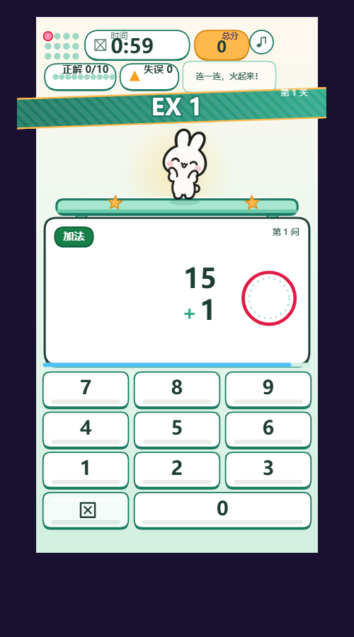
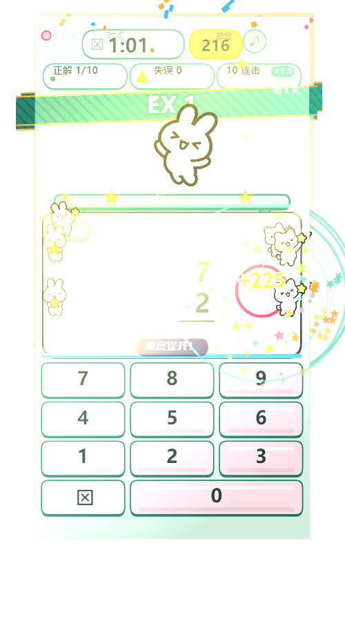

# 星算速算家 ⭐

> 小学 1—6 年级算术速算闯关 · 微信小游戏 + H5 双端 · 零依赖零构建

| 主页（薄荷奶油配色 + 动画公仔） | 游戏页（复刻参考视频） | 9 连击全场庆典 |
|---|---|---|
|  |  |  |

## ✨ 特性

- **1:1 复刻参考视频玩法**：竖排算式、数字键盘实时判定、连击倍率、难度爬升、关卡横幅
- **v3 判定模型**：输入过程**永不自动判错**——慢慢想、手抖、中途改答案都来得及；判错只来自单题限时（一年级 12s，保底 8s）
- **定点数运算**：全程整数计算，90000 题实测零误判（浮点误差会把 76.3×6.8=518.84 判错）
- **零音频文件**：BGM 与音效全部 WebAudio 实时合成，音阶随连击升调
- **热闹氛围**：小动物进进出出（背景观众横穿 + 连击探头欢呼）、9 连击全场庆典（彩带+满天星星+常驻公仔）
- **双端同源**：`shared/` 单一事实源，微信小游戏（CommonJS 构建产物）与 H5（原生 ESM）行为一致
- **四层存档自愈**：校验→修补→迁移→备份，孩子 23 天的努力不会因为一次损坏归零
- **6 年级 × 10 档难度**：answer-first 反向出题，17100 题抽样零超纲零负数

## 🚀 快速开始

### H5 版（最快）

```bash
python -m http.server 8899
# 浏览器打开 http://127.0.0.1:8899/web/index.html
```

> 必须走 http（ESM 的 CORS 限制），不能 `file://` 直接打开。
> 桌面端支持键盘 0-9 答题、Backspace 退格。

### 微信小游戏

```bash
node tools/build-mp.mjs     # ESM → CommonJS，产物在 dist/mp/
```

微信开发者工具「导入项目」→ 选择 `dist/mp/` → AppID 用测试号。

### 测试

```bash
node tools/check-runtime.mjs      # 静态自检（导入/导出/作用域/执行）
node test/input-flow.test.mjs     # 判定模型 18 项
node test/gen.test.mjs            # 出题 17100 题抽样
node test/fixed.test.mjs          # 定点精度 90000 题
node test/full-flow.mjs           # 端到端一整局
node tools/check-budget.mjs       # 包体预算（主包 2.03MB / 上限 4MB）
```

## 📐 产品文档

**[`PRD.md`](PRD.md)** —— 可复建级 PRD：完整功能规格、判定模型 v3 语义、全部数值配置表、验收清单、升级路线图。拿这份文档 + 素材可以用任何工具重建出功能等价的版本。

| 文档 | 内容 |
|---|---|
| [docs/DECISIONS.md](docs/DECISIONS.md) | 18 条关键决策记录（含被否决方案与理由）★ |
| [docs/UI_SPEC.md](docs/UI_SPEC.md) | 全部坐标/色值/字号/组件状态 |
| [docs/FRONTEND_SPEC.md](docs/FRONTEND_SPEC.md) | 前端架构与算法 |
| [docs/STORAGE_SPEC.md](docs/STORAGE_SPEC.md) | 存档结构与四层自愈 |
| [docs/GROWTH_SPEC.md](docs/GROWTH_SPEC.md) | 增长/留存/防刷红线 |

## 🎮 玩法速览

- **6 个年级**独立难度（一年级 20 以内加减 → 六年级百万级混合运算/分数）
- **难度自适应**：每 5 连击 DL+1（上限 10），连错 2 次 DL-1——始终匹配孩子水平
- **连击倍率**：5 连击 ×1.25 … 50 连击 ×3.0；连击越高特效越炸
- **连击庆典**：2 连击小动物探头 → 6 连击全体欢呼 → **9 连击全场庆典 + 常驻公仔陪玩**
- **挑战赛**：有效通关 3 次解锁「再来 90 秒」，独立计分防刷，每日限次
- **能力纪念章**：首次满星/精准/完美/闪电/疾速，纯荣誉不设门槛

## 🏗️ 技术要点

| 项 | 方案 |
|---|---|
| 渲染 | 原生 Canvas 2D，单画布，分层绘制 |
| 判定 | **定点整数运算**（shared/fixed.js），9 万题零误判 |
| 输入 | 宽限判定模型 v3 + 预输入缓冲（反馈期/横幅期按键不丢） |
| 音频 | WebAudio 实时合成（BGM 五声音阶 + 12 种音效） |
| 跨端 | shared 单一事实源 + `tools/build-mp.mjs` 零依赖转译 |
| 包体 | 2.03MB / 微信上限 4MB |

## 📁 目录

```
shared/       跨端核心逻辑（出题/判定/计分/配置）
miniprogram/  微信小游戏源码（scenes/ui/fx/store/core）
web/          H5 入口
dist/mp/      微信开发者工具直接导入的构建产物
tools/        构建 + 4 个自动校验脚本
test/         13 套测试（数值/判定/流程/防作弊/自愈）
docs/         全套规格文档
screenshots/  实机截图
```

## 📄 License

[MIT](LICENSE)
